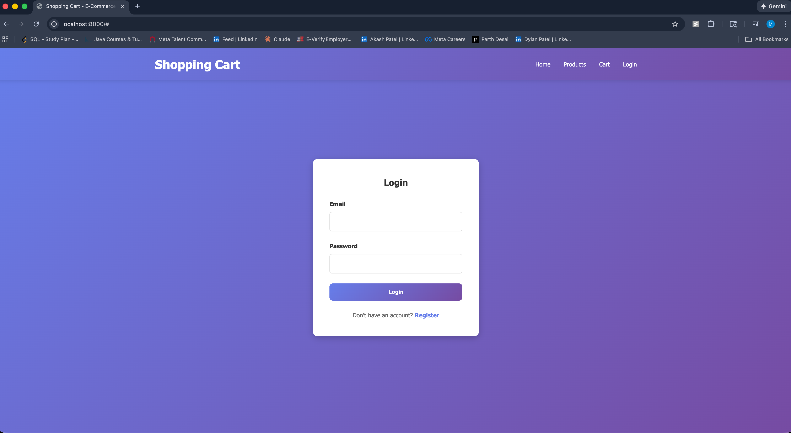
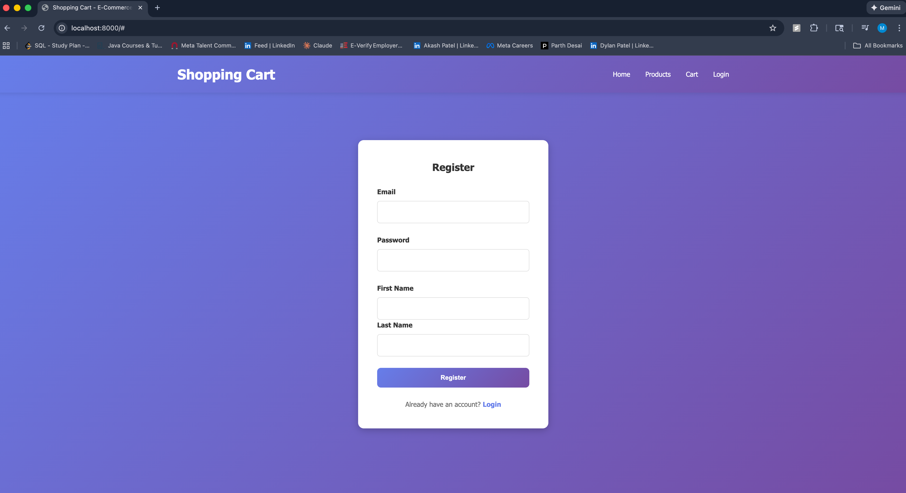
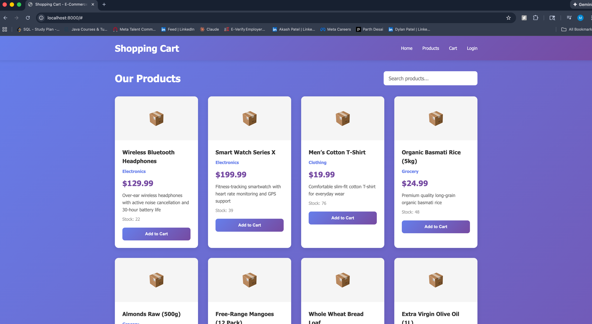
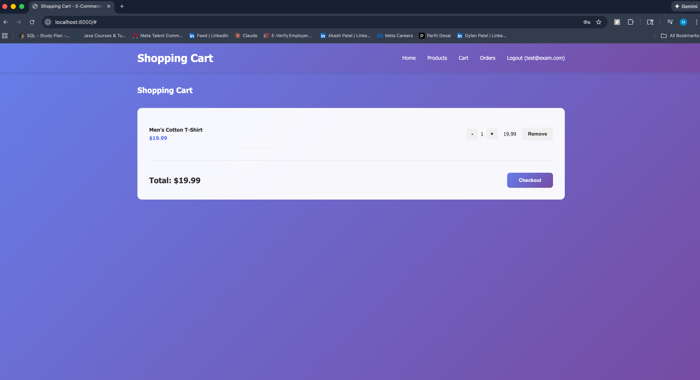
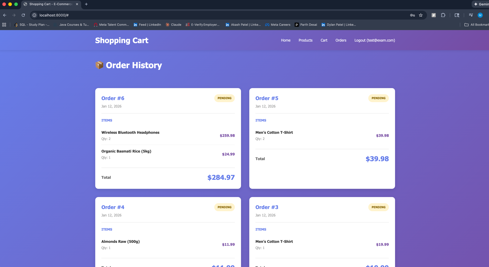
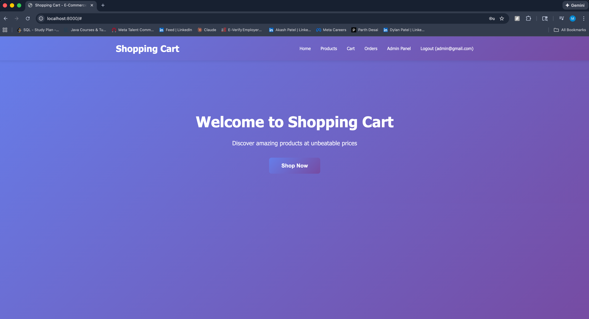
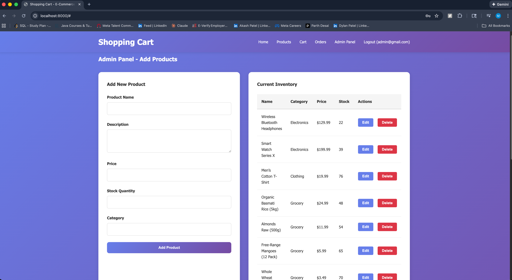

# Shopping Cart _ E-Commerce Platform 🛒

<div align="center">


A full-stack, production-ready e-commerce platform with user authentication, shopping cart, order management, and admin dashboard.

[Features](#-features) • [Quick Start](#-quick-start) • [API Docs](#-api-documentation) • [Tech Stack](#-tech-stack) • [Contributing](#-contributing)

</div>

---

## 📋 Table of Contents

- [Features](#-features)
- [Tech Stack](#-tech-stack)
- [Quick Start](#-quick-start)
- [Project Structure](#-project-structure)
- [API Documentation](#-api-documentation)
- [Configuration](#-configuration)
- [Usage Examples](#-usage-examples)
- [Troubleshooting](#-troubleshooting)
- [Contributing](#-contributing)
- [License](#-license)

---

## ✨ Features

### 🔐 Authentication & Authorization
- User registration and login with JWT tokens
- Role-based access control (User & Admin)
- Automatic token expiration (24 hours)
- Secure password encryption with BCrypt

### 🛍️ Shopping Features
- Browse products with search functionality
- Filter products by category
- Add items to shopping cart
- Manage cart quantities
- Checkout and order creation
- View order history and details

### 👨‍💼 Admin Features
- Full product inventory management
- Add, edit, and delete products
- Real-time stock management
- Order status updates (Not implemented)
- Admin-only dashboard

### 🎯 User Experience
- Responsive design for desktop and mobile
- Real-time cart updates
- Intuitive navigation
- Fast load times
- Session persistence

---

## 📸 Application GUI Screenshots

### 🔐 Authentication
<p align="center">
  
  
</p>

### 🏠 Landing & Home
<p align="center">
  
  
</p>

### 🛍️ Products & Cart
<p align="center">
  
  
</p>

### 📦 Orders
<p align="center">
  
</p>

### 👨‍💼 Admin Panel
<p align="center">
  
  
</p>

---


## 🏗️ Tech Stack

### Backend
```
Java 17+ • Spring Boot 3.x • Spring Security • JWT
Spring Data JPA • Hibernate • MySQL • Maven
```

### Frontend
```
HTML5 • CSS3 • Vanilla JavaScript (ES6+)
RESTful API • LocalStorage
```

### Database
```
MySQL 8.0+ • JPA/Hibernate ORM
```

---

## 🚀 Quick Start

### Prerequisites
- ✅ Java 17+
- ✅ Maven 3.6+
- ✅ MySQL 8.0+
- ✅ Git

### Installation

#### 1️⃣ Clone the Repository
```bash
git clone https://github.com/jyanimaulik/shopping-cart.git
cd shopping-cart
```

#### 2️⃣ Setup Database
```sql
-- Create database
CREATE DATABASE ecommerce;
USE ecommerce;
```

#### 3️⃣ Configure Backend
Edit `src/main/resources/application.properties`:

```properties
# Database
spring.datasource.url=jdbc:mysql://localhost:3306/ecommerce
spring.datasource.username=root
spring.datasource.password=your_password
spring.jpa.hibernate.ddl-auto=update

# JWT
jwt.secret=your-super-secret-key-must-be-at-least-32-characters-long
jwt.expiration=86400000

# Server
server.port=8080
server.servlet.context-path=/
spring.application.name=ecommerce-platform
```

#### 4️⃣ Build & Run Backend
```bash
mvn clean install
mvn spring-boot:run
```

✅ Backend runs on `http://localhost:8080`

#### 5️⃣ Run Frontend
```bash
# Option 1: Python
cd frontend
python -m http.server 8000

# Option 2: Node.js
npx http-server

# Option 3: Open directly
# Open frontend/index.html in your browser
```

✅ Frontend runs on `http://localhost:8000`

---

## 📁 Project Structure

```
shopping-cart/
│
├── frontend/
│   ├── index.html          # Main HTML
│   ├── app.js              # JavaScript logic
│   └── styles.css          # Styling
│
├── src/main/java/com/ecommerce/
│   ├── controller/          # REST APIs
│   │   ├── AuthController.java
│   │   ├── ProductController.java
│   │   ├── CartController.java
│   │   └── OrderController.java
│   │
│   ├── entity/              # Database models
│   │   ├── User.java
│   │   ├── Product.java
│   │   ├── Cart.java
│   │   ├── Order.java
│   │   └── Role.java
│   │
│   ├── dto/                 # Data transfer objects
│   │   ├── AuthResponse.java
│   │   ├── ProductRequest.java
│   │   ├── CartResponse.java
│   │   └── OrderResponse.java
│   │
│   ├── service/             # Business logic
│   │   ├── AuthService.java
│   │   ├── ProductService.java
│   │   ├── CartService.java
│   │   └── OrderService.java
│   │
│   ├── repository/          # Data access
│   │   ├── UserRepository.java
│   │   ├── ProductRepository.java
│   │   ├── CartRepository.java
│   │   └── OrderRepository.java
│   │
│   ├── security/            # JWT & Security
│   │   ├── JwtTokenProvider.java
│   │   ├── JwtAuthenticationFilter.java
│   │   └── SecurityConfig.java
│   │
│   └── EcommercePlatformApplication.java
│
├── src/main/resources/
│   └── application.properties
│
├── pom.xml                  # Maven dependencies
├── README.md                # This file
└── .gitignore
```

---

## 🔌 API Documentation

### 🔐 Authentication Endpoints

#### Register User
```http
POST /api/auth/register
Content-Type: application/json

{
  "email": "user@example.com",
  "password": "password123",
  "firstName": "John",
  "lastName": "Doe"
}

Response: 201 Created
{
  "token": "eyJhbGciOiJIUzUxMiJ9...",
  "email": "user@example.com",
  "firstName": "John",
  "lastName": "Doe",
  "roles": ["ROLE_USER"]
}
```

#### Login User
```http
POST /api/auth/login
Content-Type: application/json

{
  "email": "user@example.com",
  "password": "password123"
}

Response: 200 OK
{
  "token": "eyJhbGciOiJIUzUxMiJ9...",
  "email": "user@example.com",
  "firstName": "John",
  "lastName": "Doe",
  "roles": ["ROLE_USER"]
}
```

### 📦 Product Endpoints

#### Get All Products
```http
GET /api/products
Response: 200 OK
[
  {
    "id": 1,
    "name": "Laptop",
    "description": "High performance laptop",
    "price": 999.99,
    "stock": 50,
    "category": "Electronics"
  }
]
```

#### Get Product by ID
```http
GET /api/products/{id}
Response: 200 OK
{
  "id": 1,
  "name": "Laptop",
  "price": 999.99,
  "stock": 50
}
```

#### Search Products
```http
GET /api/products/search?keyword=laptop
Response: 200 OK
[...]
```

#### Create Product (Admin Only)
```http
POST /api/products
Authorization: Bearer {token}
Content-Type: application/json

{
  "name": "New Product",
  "description": "Product description",
  "price": 49.99,
  "stock": 100,
  "category": "Electronics"
}

Response: 201 Created
```

#### Update Product (Admin Only)
```http
PUT /api/products/{id}
Authorization: Bearer {token}
Content-Type: application/json

{
  "name": "Updated Product",
  "price": 59.99
}

Response: 200 OK
```

#### Delete Product (Admin Only)
```http
DELETE /api/products/{id}
Authorization: Bearer {token}
Response: 204 No Content
```

### 🛒 Cart Endpoints

#### Get Cart
```http
GET /api/cart
Authorization: Bearer {token}
Response: 200 OK
{
  "cartId": 1,
  "items": [
    {
      "id": 1,
      "product": {...},
      "quantity": 2,
      "subtotal": 199.98
    }
  ],
  "totalPrice": 199.98
}
```

#### Add to Cart
```http
POST /api/cart/items
Authorization: Bearer {token}
Content-Type: application/json

{
  "productId": 1,
  "quantity": 2
}

Response: 201 Created
```

#### Update Cart Item
```http
PUT /api/cart/items/{itemId}?quantity=3
Authorization: Bearer {token}
Response: 200 OK
```

#### Remove from Cart
```http
DELETE /api/cart/items/{itemId}
Authorization: Bearer {token}
Response: 200 OK
```

### 📋 Order Endpoints

#### Create Order
```http
POST /api/orders
Authorization: Bearer {token}
Response: 201 Created
{
  "id": 1,
  "items": [...],
  "totalPrice": 199.98,
  "status": "PENDING",
  "createdAt": 1642348800000
}
```

#### Get User Orders
```http
GET /api/orders
Authorization: Bearer {token}
Response: 200 OK
[
  {
    "id": 1,
    "totalPrice": 199.98,
    "status": "PENDING"
  }
]
```

#### Get Order by ID
```http
GET /api/orders/{orderId}
Authorization: Bearer {token}
Response: 200 OK
```

#### Update Order Status (Admin Only)
```http
PUT /api/orders/{orderId}/status?status=SHIPPED
Authorization: Bearer {token}
Response: 200 OK
```

---

## ⚙️ Configuration

### JWT Configuration
```properties
# Token expiration in milliseconds (24 hours)
jwt.expiration=86400000

# Secret key (min 32 characters for HS512)
jwt.secret=YourSuperSecretKeyMustBeAtLeast32CharactersLong!!!
```

### Database Configuration
```properties
spring.datasource.url=jdbc:mysql://localhost:3306/ecommerce
spring.datasource.username=root
spring.datasource.password=password
spring.jpa.hibernate.ddl-auto=update
```

### CORS Configuration
Frontend origins are whitelisted in `SecurityConfig.java`:
- `http://localhost:8000`
- `http://localhost:8080`
- `http://localhost:3000`

---

## 💡 Usage Examples

### Register & Login
```javascript
// Frontend: app.js
await fetch('http://localhost:8080/api/auth/register', {
  method: 'POST',
  headers: { 'Content-Type': 'application/json' },
  body: JSON.stringify({
    email: 'user@example.com',
    password: 'password123',
    firstName: 'John',
    lastName: 'Doe'
  })
});
```

### Add to Cart
```javascript
const response = await fetch('http://localhost:8080/api/cart/items', {
  method: 'POST',
  headers: {
    'Content-Type': 'application/json',
    'Authorization': `Bearer ${token}`
  },
  body: JSON.stringify({
    productId: 1,
    quantity: 2
  })
});
```

### Checkout
```javascript
const order = await fetch('http://localhost:8080/api/orders', {
  method: 'POST',
  headers: { 'Authorization': `Bearer ${token}` }
});
```

---

## 🐛 Troubleshooting

| Issue | Solution |
|-------|----------|
| **Port 8080 already in use** | Change `server.port` in application.properties |
| **Database connection failed** | Verify MySQL is running, check credentials |
| **CORS error** | Add frontend URL to `corsConfigurationSource()` in SecurityConfig |
| **Token expired** | Clear localStorage, login again |
| **Products not loading** | Check API_URL in frontend app.js matches backend URL |
| **Admin features not working** | Ensure user has ROLE_ADMIN in database |

---

## 🤝 Contributing

We love contributions! Here's how:

```bash
# 1. Fork the repository
# 2. Create feature branch
git checkout -b feature/AmazingFeature

# 3. Commit changes
git commit -m 'Add AmazingFeature'

# 4. Push to branch
git push origin feature/AmazingFeature

# 5. Open Pull Request
```

### Contribution Guidelines
- Follow existing code style
- Add comments for complex logic
- Test features before submitting PR
- Update README if adding new features

---

## 📄 License

This project is licensed under the MIT License - see the [LICENSE](LICENSE) file for details.

```
MIT License - Free to use, modify, and distribute
```

---

## 👤 Author

**Your Name**
- GitHub: [@jyanimaulik](https://github.com/jyanimaulik)
- Email: jyanimaulik.ca@gmail.com

---

## 🙋 Support

- 📖 Check the [documentation](https://github.com/jyanimaulik/shopping-cart/wiki)
- 🐛 Report bugs on [Issues](https://github.com/jyanimaulik/shopping-cart/issues)
- 💬 Start a [Discussion](https://github.com/jyanimaulik/shopping-cart/discussions)

---

<div align="center">

**⭐ If you found this project helpful, please give it a star!**

[Back to Top](#shopping-cart---modern-e-commerce-platform-)

</div>
